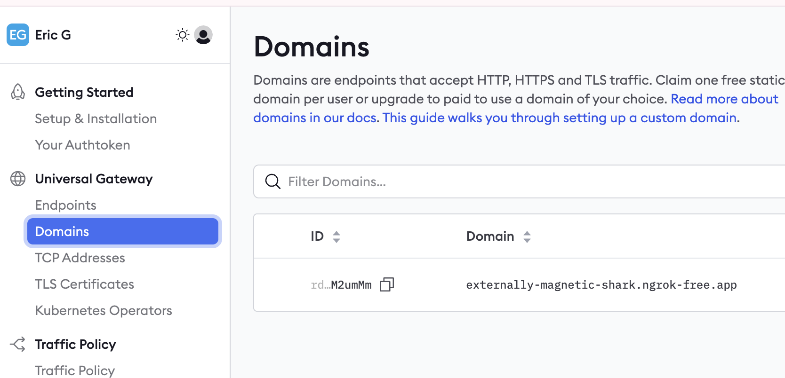

# AI Voice Assistant with Twilio and Google Gemini (Python)

This project creates a AI voice assistant that uses [Twilio Voice](https://www.twilio.com/en-us/voice) and [ConversationRelay](https://www.twilio.com/en-us/products/conversational-ai/conversationrelay), and the [Google Gemini API](https://ai.google.dev/) to engage in two-way conversations over a phone call.

## Overview

This application allows users to call a Twilio number and interact with an AI assistant powered by Google's `gemini-2.5-flash` model. The assistant will respond to user queries in natural, spoken language.

## Prerequisites

- [Python 3.10+](https://www.python.org/downloads/)
- A Twilio Account: Sign up for a [free trial here](https://twil.io/try-twilio).
- A Twilio Number with Voice Capabilities: [Instructions to purchase a number](https://support.twilio.com/hc/en-us/articles/223180928-How-to-Buy-a-Twilio-Phone-Number).
- A Google AI API Key: Visit [Google AI Studio here](https://aistudio.google.com/) to generate a key for free.

## Installation

1. Clone this repository:

    ``` bash
    git clone https://github.com/egrinstein/voice_startup
    cd voice_startup
    ```

2. Install the required dependencies. It's recommended to use a virtual environment.

    ``` bash
    pip install -r requirements.txt
    ```

3. Configure your environment variables by creating a .env file in the root of your project:

    - You can copy the example: cp .env.example .env (if you have one) or create it manually.
    - Add your keys to the .env file:

        ``` bash
        # .env file
        GOOGLE_API_KEY="YOUR_GOOGLE_AI_API_KEY_HERE"
        NGROK_URL="your-ngrok-forwarding-url.ngrok-free.app"
        ```
    
    - You can get your Google AI API key from [Google AI Studio](https://aistudio.google.com/)
    - Install ngrok and get your NGROK_URL from [ngrok](https://ngrok.com/). See the image below where to get the URL.

4. Configure your Twilio phone number's voice webhook. In the Twilio console, navigate to your number's settings and under "A CALL COMES IN", set the webhook to your ngrok URL with the `/twiml` endpoint (e.g., https://your-ngrok-forwarding-url.ngrok-free.app/twiml). (Eric: I already did this)



## Usage

1. Start [ngrok](https://ngrok.com/) to expose your local server to the internet on port 8080:

    ``` bash
    ngrok http --url=NGROK_URL 8080
    ```

2. Run the application:

    ``` bash
    python main.py
    ```

3. Call your Twilio number and start talking to your new Gemini-powered voice assistant!

## How It Works

1. When a user calls the Twilio number, Twilio makes an HTTP request to the /twiml endpoint.
2. The application returns TwiML, which instructs Twilio to establish a WebSocket connection to the server at /ws.
3. Voice input from the user is transcribed by Twilio and sent to the server as JSON messages over the WebSocket.
4. The server sends the transcribed text to the **Google Gemini API** and gets a response.
5. The AI-generated text response is sent back to Twilio through the WebSocket.
6. Twilio's built-in Text-to-Speech (TTS) engine converts the text to audio and plays it for the user.
7. The conversation continues until the call is disconnected.

## Project Structure

- `main.py`: The main application file containing the FastAPI server, WebSocket handler, and **Google Gemini integration**.

- `requirements.txt`: A file listing the Python dependencies.

- `.env`: A file for storing environment variables like your `GOOGLE_API_KEY` and `NGROK_URL`.
