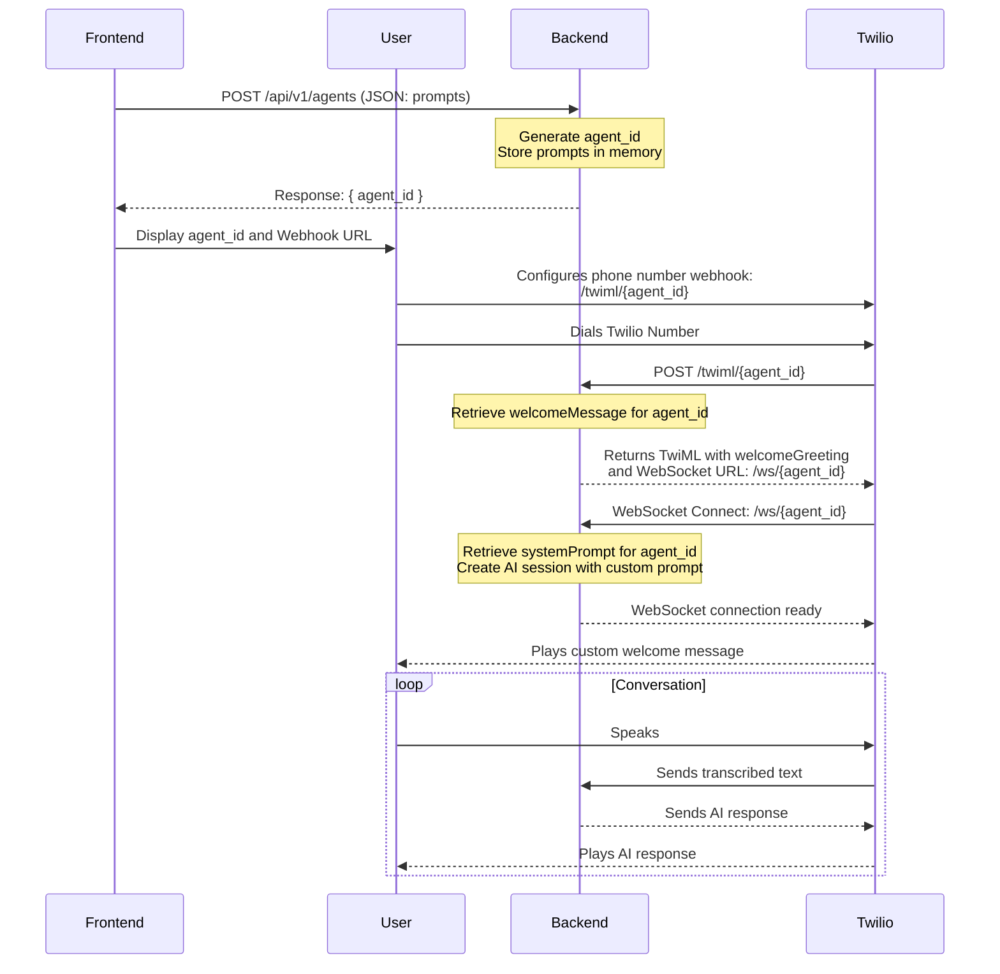

# Frontend & Backend Integration Guide

This document provides a comprehensive guide on connecting the React frontend (`apps/web`) with the Python backend (`services/api`) to enable dynamic agent creation.

## 🎯 **Objective: Dynamic Prompts**

The primary goal is to replace the hardcoded `greeting.txt` and `system_prompt.txt` with dynamic values submitted from the frontend `NewAgent` form.

## 🌊 **Integration Flow Diagram**

This diagram illustrates the complete lifecycle from creating an agent on the frontend to handling a live phone call.



## 🛠️ **API Endpoint Specification**

### Create Agent

- **Endpoint:** `POST /api/v1/agents`
- **Description:** Creates a new agent configuration with dynamic prompts.
- **Request Body:**

  ```json
  {
    "welcomeMessage": "Hello! You've reached our custom support line. How can I assist?",
    "systemPrompt": "You are a helpful assistant for a custom company. Be polite and concise."
  }
  ```

- **Success Response (200 OK):**

  ```json
  {
    "agent_id": "a1b2c3d4-e5f6-7890-g1h2-i3j4k5l6m7n8"
  }
  ```

- **Error Response (400 Bad Request):**

  ```json
  {
    "detail": "welcomeMessage and systemPrompt are required."
  }
  ```

---

## 💻 **Frontend Implementation Guide (`apps/web`)**

### **File to Modify:** `apps/web/src/pages/NewAgent.tsx`

The `handleCreate` function needs to be updated to send the data from the form's state to our new API endpoint.

```typescript
// ... imports

const NewAgent = () => {
  const navigate = useNavigate();
  
  // This state already exists and collects the user's input
  const [agentConfig, setAgentConfig] = useState({
    // ... other fields
    welcomeMessage: "Hello! How can I help you today?",
    systemPrompt: "",
  });

  const [isCreating, setIsCreating] = useState(false);
  const [apiError, setApiError] = useState<string | null>(null);
  
  // NEW: State to hold the created agent ID and display to the user
  const [createdAgentId, setCreatedAgentId] = useState<string | null>(null);

  const handleCreate = async () => {
    setIsCreating(true);
    setApiError(null);
    setCreatedAgentId(null);

    // Validate that prompts are not empty
    if (!agentConfig.welcomeMessage || !agentConfig.systemPrompt) {
      setApiError("Welcome message and system prompt cannot be empty.");
      setIsCreating(false);
      return;
    }

    try {
      // The API endpoint should be stored in an environment variable
      const apiEndpoint = import.meta.env.VITE_API_URL || 'http://localhost:8080';
      
      const response = await fetch(`${apiEndpoint}/api/v1/agents`, {
        method: 'POST',
        headers: {
          'Content-Type': 'application/json',
        },
        body: JSON.stringify({
          welcomeMessage: agentConfig.welcomeMessage,
          systemPrompt: agent_config.systemPrompt,
        }),
      });

      if (!response.ok) {
        throw new Error(`API Error: ${response.statusText}`);
      }

      const result = await response.json();
      setCreatedAgentId(result.agent_id);
      
      // Optionally navigate to a success page or show a success message
      // navigate(`/build/agent/${result.agent_id}`);

    } catch (error) {
      console.error("Failed to create agent:", error);
      setApiError(error.message);
    } finally {
      setIsCreating(false);
    }
  };

  // ... other functions (updateConfig, etc.)

  return (
    // ... existing JSX ...
    
    // Inside the form, add a place to display the result
    {createdAgentId && (
      <Card className="mt-6 bg-green-50 border-green-200">
        <CardHeader>
          <CardTitle className="text-green-800">Agent Created Successfully!</CardTitle>
        </CardHeader>
        <CardContent>
          <p className="text-sm text-green-700">Configure your Twilio phone number's voice webhook to:</p>
          <Input 
            readOnly 
            value={`https://YOUR_NGROK_URL/twiml/${createdAgentId}`} 
            className="mt-2 font-mono bg-green-100"
          />
        </CardContent>
      </Card>
    )}

    {apiError && <p className="text-red-500 mt-4">{apiError}</p>}

    <Button onClick={handleCreate} disabled={isCreating}>
      {isCreating ? "Creating Agent..." : "Create Agent"}
    </Button>
    
    // ... rest of JSX
  );
};

export default NewAgent;
```

---

## 🔧 **Backend Implementation Guide (`services/api`)**

The backend needs significant restructuring to stop using hardcoded files and start handling dynamic agent configurations.

### **1. Create an In-Memory "Database"**

For simplicity, we'll use a Python dictionary to store agent configurations. In a production system, this would be a real database (e.g., PostgreSQL, Redis).

**File to Modify:** `services/api/main.py` (add at the top)

```python
import uuid

# In-memory storage for agent configurations
# Production: Replace with a proper database (e.g., Redis, PostgreSQL)
AGENTS_DB = {}
```

### **2. Define the Request Model with Pydantic**

FastAPI uses Pydantic for request validation and type safety.

**File to Modify:** `services/api/main.py` (add near the top)

```python
from pydantic import BaseModel, Field

class AgentConfigRequest(BaseModel):
    welcome_message: str = Field(..., min_length=1, description="The initial greeting message for the call.")
    system_prompt: str = Field(..., min_length=1, description="The system instructions for the AI model.")
```

### **3. Create the New API Endpoint**

**File to Modify:** `services/api/main.py`

```python
# Add this new endpoint function within main.py

@app.post("/api/v1/agents")
async def create_agent(config: AgentConfigRequest):
    """Creates a new agent configuration and returns a unique ID."""
    agent_id = str(uuid.uuid4())
    AGENTS_DB[agent_id] = {
        "welcome_message": config.welcome_message,
        "system_prompt": config.system_prompt
    }
    print(f"Created new agent with ID: {agent_id}")
    return {"agent_id": agent_id}
```

### **4. Modify the TwiML Endpoint**

Update the `/twiml` endpoint to accept an `agent_id` and use the corresponding welcome message.

**File to Modify:** `services/api/main.py`

```python
# Replace the existing /twiml endpoint with this new version

@app.post("/twiml/{agent_id}")
async def twiml_endpoint(agent_id: str):
    """Endpoint that returns TwiML using a dynamic welcome greeting."""
    agent_config = AGENTS_DB.get(agent_id)
    if not agent_config:
        return Response(content="Agent configuration not found.", status_code=404)

    welcome_greeting = agent_config["welcome_message"]
    
    # The WebSocket URL now also includes the agent_id
    websocket_url_with_agent = f"{WS_URL}/{agent_id}"

    xml_response = f"""<?xml version="1.0" encoding="UTF-8"?>
    <Response>
    <Connect>
    <ConversationRelay url="{websocket_url_with_agent}" welcomeGreeting="{welcome_greeting}" ttsProvider="ElevenLabs" voice="FGY2WhTYpPnrIDTdsKH5" />
    </Connect>
    </Response>"""
    
    return Response(content=xml_response, media_type="text/xml")
```

### **5. Modify the WebSocket Endpoint**

Update the `/ws` endpoint to accept the `agent_id` to use the correct system prompt.

**File to Modify:** `services/api/main.py`

```python
# Replace the existing /ws endpoint with this new version

@app.websocket("/ws/{agent_id}")
async def websocket_endpoint(websocket: WebSocket, agent_id: str):
    """WebSocket endpoint that uses a dynamic system prompt for the AI session."""
    await websocket.accept()
    
    agent_config = AGENTS_DB.get(agent_id)
    if not agent_config:
        print(f"Closing WebSocket for unknown agent_id: {agent_id}")
        await websocket.close(code=1008)
        return

    system_prompt = agent_config["system_prompt"]
    call_sid = None
    
    try:
        while True:
            data = await websocket.receive_text()
            message = json.loads(data)
            
            if message["type"] == "setup":
                call_sid = message["callSid"]
                print(f"Setup for call: {call_sid} with agent: {agent_id}")
                # Create a new chat session with the DYNAMIC system prompt
                llm.create_session(call_sid, system_prompt)
            
            # ... The rest of the WebSocket logic remains the same ...
            # (elif message["type"] == "prompt", etc.)

    except WebSocketDisconnect:
        # ... existing disconnect logic ...
```

### **6. Refactor `llm.py` to Accept Dynamic Prompts**

The `GeminiLLM` class must be changed to not load prompts from files. Instead, the `system_prompt` will be passed in when a session is created.

**File to Modify:** `services/api/llm.py`

```python
import os
import google.generativeai as genai
from typing import Dict, Optional
from settings import GOOGLE_API_KEY

# REMOVE THESE FUNCTIONS AND GLOBAL CONSTANTS
# def get_system_prompt(): ...
# def get_greeting(): ...
# SYSTEM_PROMPT = get_system_prompt()
# GREETING = get_greeting()

class GeminiLLM:
    """A class to handle all Gemini AI interactions and session management."""

    def __init__(self):
        """Initialize the Gemini LLM with API key configuration."""
        genai.configure(api_key=GOOGLE_API_KEY)
        self.sessions: Dict[str, any] = {}

    # MODIFY create_session to accept the system_prompt
    def create_session(self, call_sid: str, system_prompt: str) -> None:
        """Create a new chat session for a call with a dynamic system prompt."""
        # The model is now created here, with the specific instructions for this session
        model = genai.GenerativeModel(
            model_name="gemini-2.5-flash", 
            system_instruction=system_prompt
        )
        self.sessions[call_sid] = model.start_chat(history=[])

    # ... The rest of the methods (get_session, remove_session, get_response, has_session) remain the same ...
```

## ✅ **Summary of Changes**

- **Frontend:** Sends `welcomeMessage` and `systemPrompt` to the backend and displays the returned `agent_id` and webhook URL.
- **Backend:**
  - No longer uses hardcoded text files for prompts.
  - Has a new `POST /api/v1/agents` endpoint to create agent configurations.
  - Stores configurations in memory.
  - Uses `agent_id` in webhook and WebSocket URLs to retrieve and use the correct prompts for each call.
- **Result:** A truly dynamic, multi-agent-ready platform. 